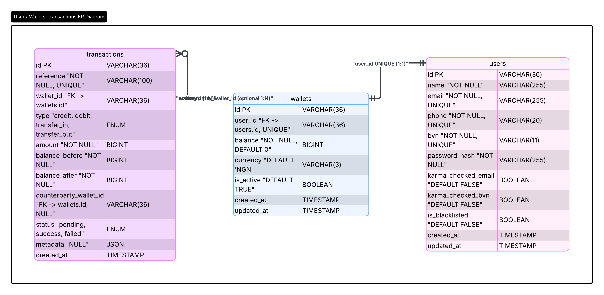

# Demo Credit Wallet Service

**Author:** Sunday Prince  
**Assessment:** Lendsqr Backend Engineering  
**Stack:** Node.js, TypeScript, Express, KnexJS, MySQL

Demo Credit is an MVP wallet API for a mobile lending product. Borrowers receive loan disbursements into a wallet and repay from it. This service handles account creation, login, wallet funding, peer transfers, and withdrawals, with a Karma blacklist check at onboarding so flagged users never get through.

---

## Live API

```
https://sunday-prince-lendsqr-be-test.<your-platform-domain>
```

Health check (unversioned):

```
GET /health
```

---

## Assessment Requirements

| Requirement                   | Status | Notes                                 |
| ----------------------------- | ------ | ------------------------------------- |
| Create account                | Done   | `POST /api/v1/auth/register`          |
| Fund wallet                   | Done   | `POST /api/v1/wallet/fund`            |
| Transfer funds                | Done   | `POST /api/v1/wallet/transfer`        |
| Withdraw funds                | Done   | `POST /api/v1/wallet/withdraw`        |
| Karma blacklist on onboarding | Done   | Dual check: email, then BVN           |
| Faux token authentication     | Done   | Bearer token on all wallet routes     |
| Node.js + TypeScript          | Done   | Strict TypeScript, Node 20+           |
| KnexJS + MySQL                | Done   | Migrations, seeds, transactions       |
| Unit tests                    | Done   | 51 tests, positive and negative cases |
| API versioning                | Done   | All routes under `/api/v1`            |

---

## Entity Relationship Diagram



### Relationships

```
users (1) ---- (1) wallets (1) ---- (many) transactions
                      |
                      +---- (nullable) counterparty_wallet_id -> wallets.id
```

### Tables

**users:** identity and Karma audit flags  
UUID primary key. Unique constraints on `email`, `phone`, and `bvn`. Stores `karma_checked_email`, `karma_checked_bvn`, and `is_blacklisted` for auditability.

**wallets:** one per user  
`balance` stored as `BIGINT` in **kobo** (₦1 = 100 kobo). `user_id` is unique, which enforces one wallet per user.

**transactions:** immutable money ledger  
Append-only audit trail. Every fund, transfer, and withdrawal creates a record with `balance_before` and `balance_after`. `reference` is unique for idempotency. Transfers create two ledger rows: `transfer_out` on the sender and `transfer_in` on the recipient.

---

## Architecture

```
HTTP Request
    |
    v
Controller        <- validates input shape, returns HTTP response
    |
    v
Service           <- business rules, Karma checks, balance logic
    |
    v
Repository        <- database queries only
    |
    v
MySQL
```

I chose a **layered architecture with the repository pattern** because each layer has one job. Controllers never touch SQL. Services never parse HTTP headers. Repositories never decide business rules. That separation means I can unit test wallet logic by mocking repositories (no database required in tests) and change how data is stored without rewriting business logic.

API routes are versioned under `/api/v1` so a future `v2` can ship without breaking existing clients.

### Request flow example: transfer

1. `auth.middleware` validates Bearer token, attaches `userId` to the request
2. `validate.middleware` runs Joi schema on the body
3. `WalletController` delegates to `WalletService.transfer()`
4. Service checks balance, resolves recipient, verifies idempotency key
5. Knex **database transaction** locks both wallets (`FOR UPDATE`), writes two ledger rows, updates both balances
6. If any step fails, everything rolls back. Money is never half-moved.

---

## Key Design Decisions

### Money stored in kobo, not naira decimals

All monetary values are stored as integers in kobo (`BIGINT`). The API accepts naira (`5000.00`) and converts at the boundary via `money.ts`. Floating point cannot represent money accurately (`0.1 + 0.2 !== 0.3` in IEEE 754). Integer kobo eliminates that class of bug entirely.

### Immutable transaction ledger

Every money movement appends a row to `transactions`. Rows are never updated or deleted. `balance_before` and `balance_after` are recorded on each row so any wallet balance can be reconstructed from the ledger if needed.

### Idempotency via `reference`

Clients send a unique `reference` on every fund, transfer, and withdraw. The database enforces uniqueness. If the same reference arrives again, the service returns the original result instead of processing twice. This protects against network retries debiting a user twice.

For transfers, the recipient ledger row uses `{reference}:in` internally to satisfy the unique constraint while keeping one client-facing reference.

### Database transactions for all money operations

Fund, transfer, and withdraw each run inside a single Knex transaction. Wallet rows are locked with `SELECT ... FOR UPDATE` before balance changes. Either all writes succeed or none do. This is the most important correctness guarantee in the system.

Registration also uses a database transaction, but only to atomically create the user and their wallet together. It does not write to the `transactions` ledger.

### Dual Karma check: email first, then BVN

The Adjutor Karma API accepts one identity per request. I run two sequential checks during onboarding:

1. **Email:** catches bad actors reusing known fraudulent emails
2. **BVN:** catches sophisticated fraudsters who rotate emails but share the same national identity

If email fails, BVN is never checked (saves an API call). If either check flags the user, onboarding is rejected with `403 USER_BLACKLISTED`. The attempt is still recorded with `is_blacklisted = true` for audit.

If the Karma API is unreachable, the system **fails closed**. The user is rejected rather than allowed through unverified.

### Faux Bearer token authentication

Per the assessment spec, a full auth system is not required. On registration or login, the server returns `base64(userId:AUTH_SECRET)`. Protected routes validate this via `auth.middleware`. Simple, auditable, and sufficient for the scope of this test.

### UUID primary keys

Auto-increment IDs expose record counts and allow enumeration (`/wallet/1`, `/wallet/2`). UUIDs are non-guessable, which matters in a financial system where resource identifiers should not be predictable.

### DRY where it matters, WET where rules differ

**DRY:** One response envelope (`response.helper.ts`), one error handler (`error.middleware.ts`), one validation runner (`validate.middleware.ts`), shared money conversion (`money.ts`).

**WET:** `fund`, `transfer`, and `withdraw` are separate methods, not one generic `moveMoney()`. They share a similar shape but have different validation rules, ledger types, and failure modes. Forcing them into one abstraction would hide bugs.

---

## API Reference

Interactive API docs live in the Bruno collection:

```
bruno/Demo Credit API/
```

Open the folder in [Bruno](https://www.usebruno.com/), select the **Local** or **Production** environment, run **Register** or **Login** (token saves automatically), then run wallet requests.

### Endpoints

| Method | Path                      | Auth   | Description                   |
| ------ | ------------------------- | ------ | ----------------------------- |
| `GET`  | `/health`                 | No     | Server health check           |
| `GET`  | `/api/v1`                 | No     | API version info              |
| `POST` | `/api/v1/auth/register`   | No     | Create account + wallet       |
| `POST` | `/api/v1/auth/login`      | No     | Sign in, get token            |
| `GET`  | `/api/v1/wallet`          | Bearer | Get wallet details            |
| `POST` | `/api/v1/wallet/fund`     | Bearer | Credit wallet                 |
| `POST` | `/api/v1/wallet/transfer` | Bearer | Transfer to another user      |
| `POST` | `/api/v1/wallet/withdraw` | Bearer | Debit wallet                  |
| `GET`  | `/api/v1/wallet/balance`  | Bearer | Balance + recent transactions |

### Response format

All endpoints return a consistent envelope.

**Success:**

```json
{
  "status": "success",
  "message": "Operation completed successfully",
  "data": {}
}
```

**Error:**

```json
{
  "status": "error",
  "message": "Human readable error message",
  "error": "ERROR_CODE"
}
```

### Error codes

| Code                   | HTTP | When                                     |
| ---------------------- | ---- | ---------------------------------------- |
| `VALIDATION_ERROR`     | 422  | Invalid request body                     |
| `USER_BLACKLISTED`     | 403  | Karma flagged the user                   |
| `USER_EXISTS`          | 409  | Email, phone, or BVN already registered  |
| `USER_NOT_FOUND`       | 404  | Recipient does not exist                 |
| `WALLET_NOT_FOUND`     | 404  | Wallet does not exist or inactive        |
| `INSUFFICIENT_BALANCE` | 400  | Not enough funds                         |
| `DUPLICATE_REFERENCE`  | 409  | Idempotency key already used             |
| `SELF_TRANSFER`        | 422  | Cannot transfer to own wallet            |
| `UNAUTHORIZED`         | 401  | Missing or invalid token / credentials   |
| `KARMA_SERVICE_ERROR`  | 503  | Adjutor API unreachable or misconfigured |
| `NOT_FOUND`            | 404  | Unknown route                            |
| `INTERNAL_ERROR`       | 500  | Unexpected server error                  |

### Register

```http
POST /api/v1/auth/register
Content-Type: application/json

{
  "name": "John Doe",
  "email": "john@example.com",
  "phone": "08012345678",
  "bvn": "12345678901",
  "password": "SecurePass123!"
}
```

### Login

```http
POST /api/v1/auth/login
Content-Type: application/json

{
  "email": "john@example.com",
  "password": "SecurePass123!"
}
```

**Auth success (register 201, login 200):**

```json
{
  "status": "success",
  "message": "Login successful",
  "data": {
    "user": { "id": "uuid", "name": "John Doe", "email": "john@example.com" },
    "wallet": { "id": "uuid", "balance": "5000.00", "currency": "NGN" },
    "token": "base64token"
  }
}
```

Use the returned `token` as `Authorization: Bearer <token>` on all wallet routes.

### Get wallet

```http
GET /api/v1/wallet
Authorization: Bearer <token>
```

```json
{
  "status": "success",
  "data": {
    "id": "uuid",
    "balance": "5000.00",
    "currency": "NGN",
    "is_active": true
  }
}
```

---

## Local Setup

### Prerequisites

- Node.js 20+ (LTS)
- MySQL 8+
- Adjutor API key ([sign up here](https://docs.adjutor.io/))

### Install and run

```bash
git clone <your-repo-url>
cd lendsqr-assessment
npm install
cp .env.example .env
```

Create the database:

```sql
CREATE DATABASE demo_credit CHARACTER SET utf8mb4 COLLATE utf8mb4_unicode_ci;
```

Update `.env` with your MySQL credentials and Adjutor API key, then:

```bash
npm run migrate:latest
npm run seed:run
npm run dev
```

Server starts at `http://localhost:3000`.

### Environment variables

| Variable           | Description                         |
| ------------------ | ----------------------------------- |
| `NODE_ENV`         | `development` or `production`       |
| `PORT`             | Server port (default `3000`)        |
| `DB_HOST`          | MySQL host                          |
| `DB_PORT`          | MySQL port                          |
| `DB_USER`          | MySQL user                          |
| `DB_PASSWORD`      | MySQL password                      |
| `DB_NAME`          | Database name                       |
| `DATABASE_URL`     | Full connection string (production) |
| `AUTH_SECRET`      | Secret for faux token generation    |
| `ADJUTOR_BASE_URL` | `https://adjutor.lendsqr.com/v2`    |
| `ADJUTOR_API_KEY`  | Your Adjutor API key                |

### Seed data

Three test users are created by `npm run seed:run`. All use password `SecurePass123!`.

| Name       | Email            | Balance    |
| ---------- | ---------------- | ---------- |
| John Doe   | john@example.com | ₦5,000.00  |
| Jane Doe   | jane@example.com | ₦10,000.00 |
| Alex Smith | alex@example.com | ₦0.00      |

Use **Login** in Bruno with `john@example.com` / `SecurePass123!` to test wallet routes without registering again.

---

## Testing

```bash
npm test
```

Tests use **Jest** with **ts-jest**. Services are tested in isolation. Repositories and HTTP calls are mocked so unit tests do not need a running database or live Adjutor API.

| Suite                      | What it covers                                        |
| -------------------------- | ----------------------------------------------------- |
| `karma.service.test.ts`    | Blacklist detection, fail-closed, API errors          |
| `user.service.test.ts`     | Registration, login, Karma rejection, duplicate users |
| `user.validator.test.ts`   | Registration and login input validation               |
| `wallet.fund.test.ts`      | Funding, get wallet, idempotency, balance snapshots   |
| `wallet.transfer.test.ts`  | Atomic transfer, self-transfer, insufficient balance  |
| `wallet.withdraw.test.ts`  | Withdrawal, insufficient balance, idempotency         |
| `wallet.validator.test.ts` | Amount validation (zero/negative rejected)            |
| `auth.token.test.ts`       | Token generation and validation                       |

---

## Deployment

Deploy to Railway, Heroku, or any platform that supports Node.js and MySQL.

**Target URL format:**

```
https://sunday-prince-lendsqr-be-test.<platform-domain>
```

### Production checklist

1. Set all environment variables (use `DATABASE_URL` for production MySQL)
2. Set a strong `AUTH_SECRET`
3. Set your real `ADJUTOR_API_KEY`
4. Run migrations: `npm run migrate:latest`
5. Build: `npm run build`
6. Start: `npm run start`
7. Verify: `GET /health`

Update the **Production** environment in `bruno/Demo Credit API/environments/Production.bru` with your deployed URL.

---

## Project Structure

```
src/
├── config/              # env validation, constants, database factory
├── database/
│   ├── migrations/      # Knex schema migrations
│   ├── seeds/           # Test user seed data
│   └── types.ts         # Database row interfaces
├── middlewares/
│   ├── auth.middleware.ts
│   ├── error.middleware.ts
│   ├── validate.middleware.ts
│   └── async.middleware.ts
├── modules/
│   ├── users/           # Register, login: controller, service, repository
│   └── wallet/          # Fund, transfer, withdraw: controller, service, repositories
├── tests/               # Unit tests (mirrors module structure)
├── types/               # Express request augmentation
├── utils/               # AppError, money, karma, auth token, response helper
├── app.ts               # Express app setup
└── server.ts            # Entry point

bruno/
└── Demo Credit API/     # Bruno collection for interactive API testing

knexfile.ts              # Knex environment config
jest.config.ts           # Jest + ts-jest config
tsconfig.json            # Strict TypeScript
```

---

## Tech Choices

| Package            | Why                                                                           |
| ------------------ | ----------------------------------------------------------------------------- |
| **Express**        | Standard Node HTTP framework, matches the Lendsqr stack                       |
| **KnexJS**         | Required by assessment. Explicit SQL control and readable transaction scoping |
| **mysql2**         | MySQL driver for Knex                                                         |
| **Joi**            | Request validation with declarative schemas and clear error messages          |
| **bcrypt**         | Password hashing for registration and login                                   |
| **Jest + ts-jest** | Unit tests in TypeScript without a separate compile step                      |
| **Bruno**          | Git-friendly API collection that serves as runnable API documentation         |

---

## What I Would Improve With More Time

- Integration tests against a real test database for end-to-end wallet flows
- Rate limiting on registration and wallet endpoints
- Structured logging (request ID, user ID) for production observability
- Webhook notifications on successful transfers

---

## License

ISC
